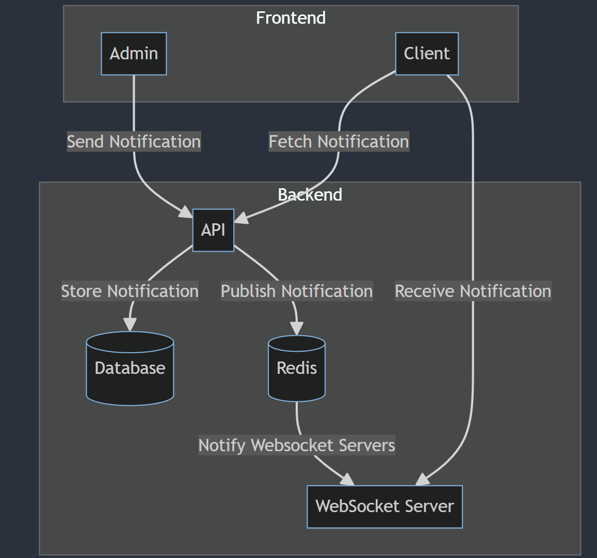

# EyeControl - test task

## Description

This is a test task for EyeControl.
The task is to create a notification. 
The notification should be sent from the admin panel and displayed in the client application.

## Requirements

- Docker. [Install Docker](https://docs.docker.com/get-docker/)

## Start the application

To start the application, run the following commands:

Run `docker-compose up` to start the application.

Command will start the following services:

- `postgres` - PostgreSQL database for storing notifications
- `redis` - Redis server for pub/sub
- `api` - express.js server for handling notifications
- `socket` - socket.io server for handling socket connections
- `client` - React client for displaying notifications
- `admin` - React admin client for sending notifications

## Architecture

## Usage

##### [http://localhost:8080/](http://localhost:8080/) - client application to display notifications
##### [http://localhost:8081/](http://localhost:8081/) - admin application to send notifications
